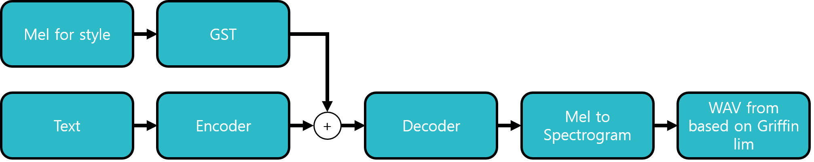
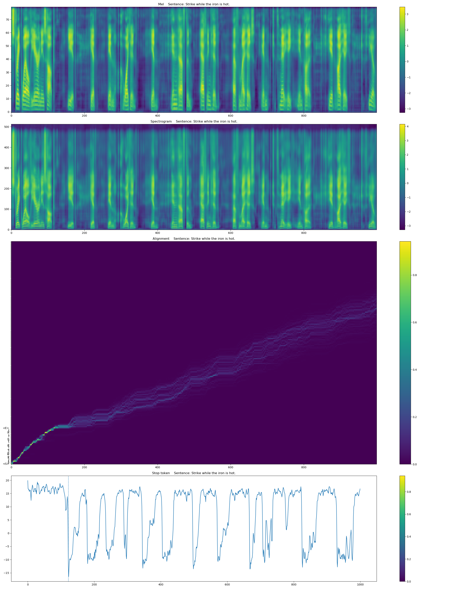
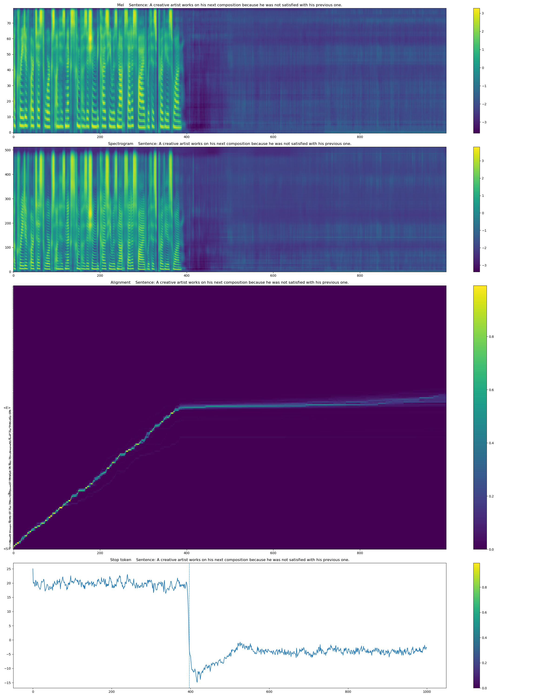
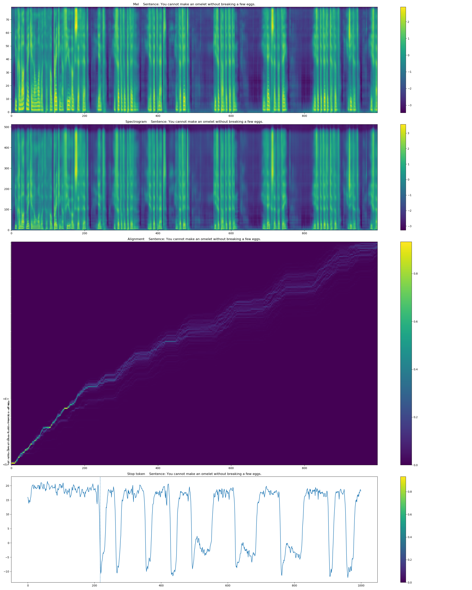
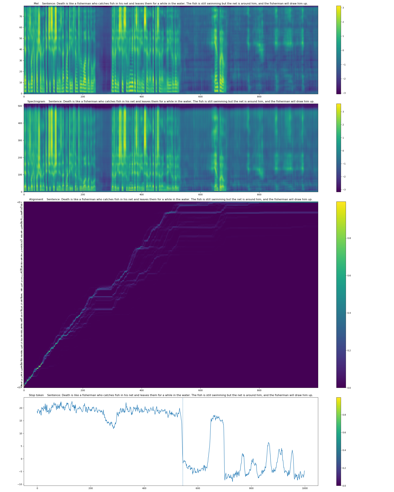
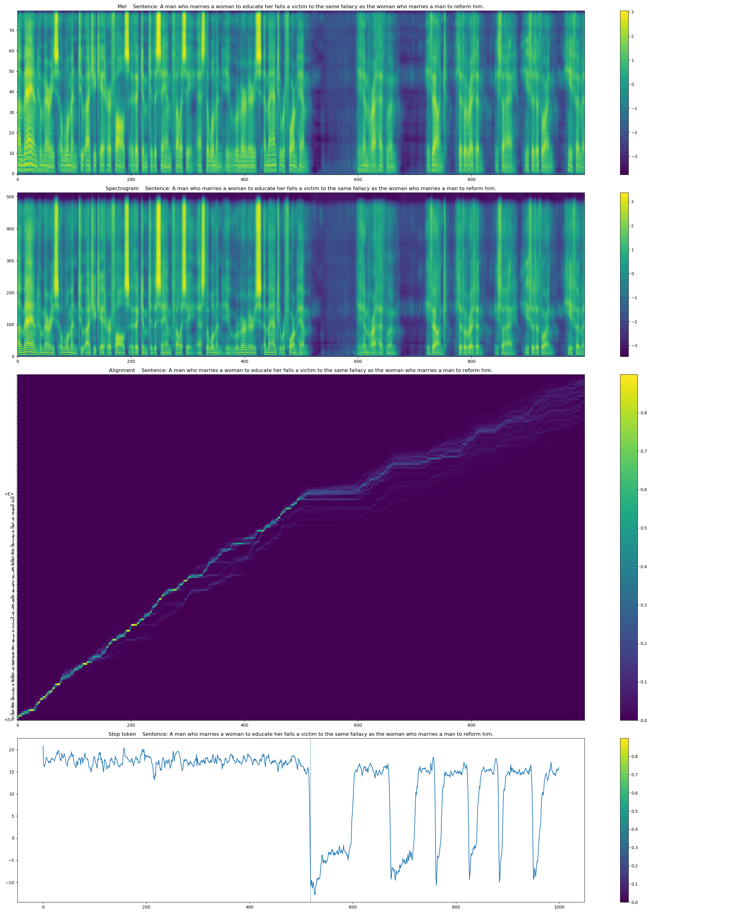
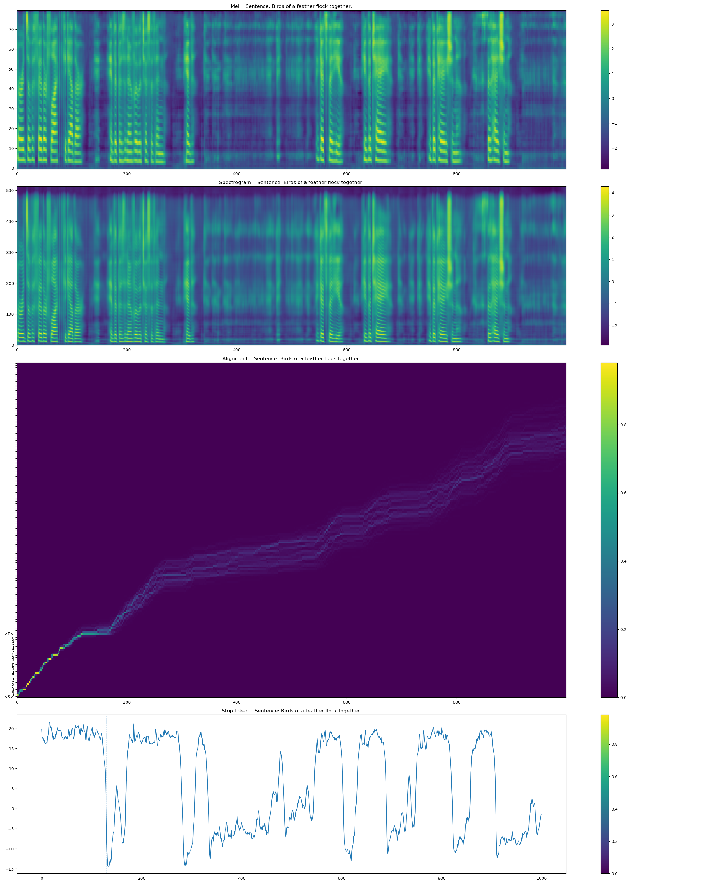
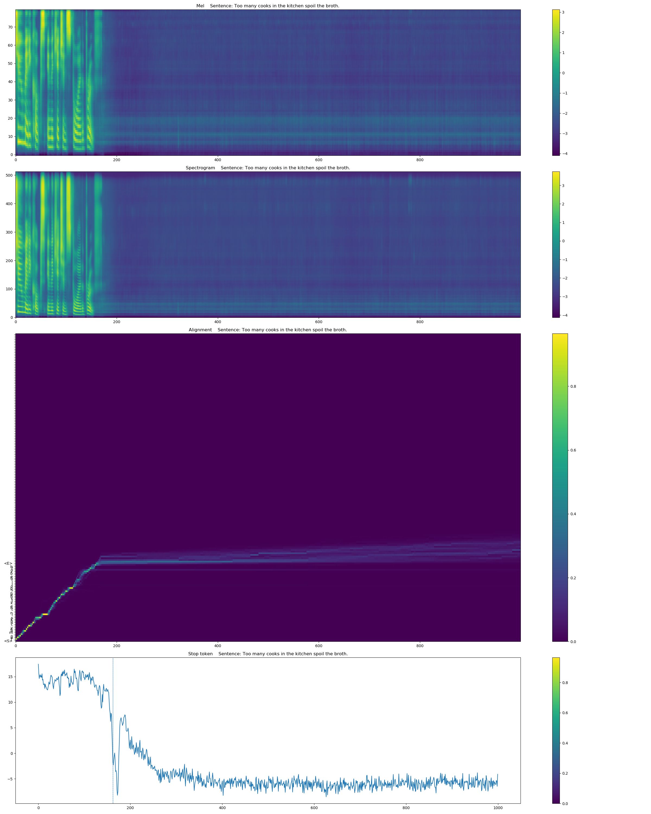
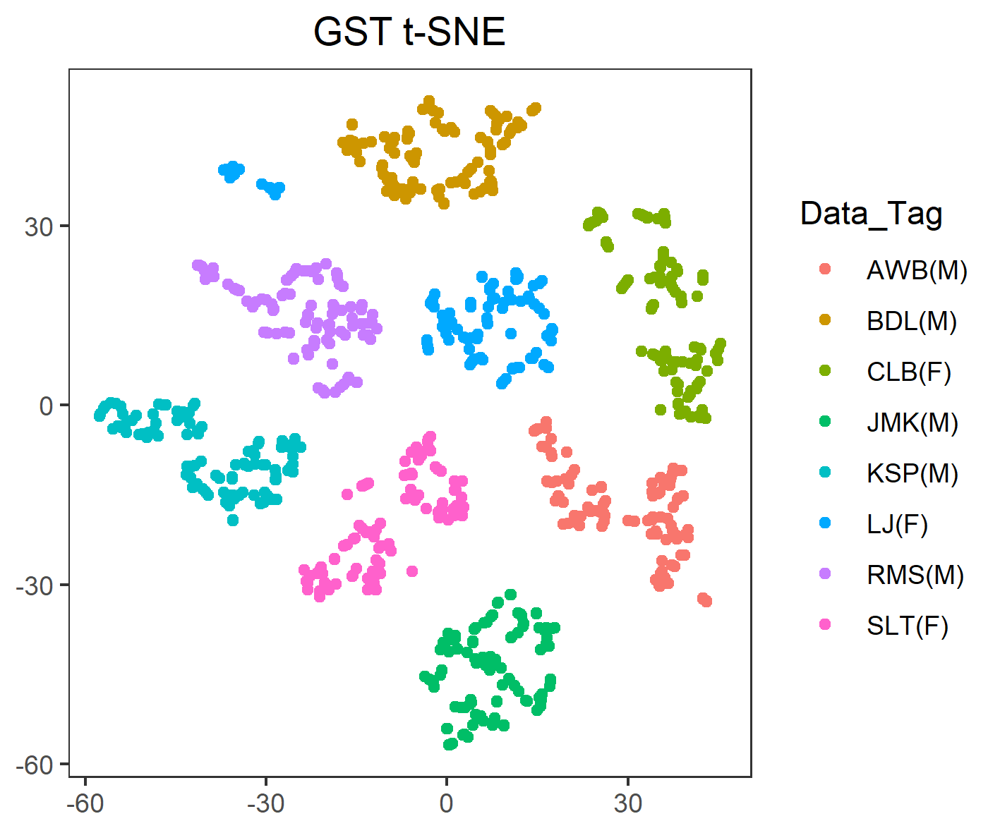

# GST Tacotron in TF2

This code is an implementation of the paper 'Style Tokens: Unsupervised Style Modeling, Control and Transfer in End-to-End Speech Synthesis'. The algorithm is based on the following papers:

```
Wang, Y., Stanton, D., Zhang, Y., Skerry-Ryan, R. J., Battenberg, E., Shor, J., ... & Saurous, R. A. (2018). Style tokens: Unsupervised style modeling, control and transfer in end-to-end speech synthesis. arXiv preprint arXiv:1803.09017.
He, M., Deng, Y., & He, L. (2019). Robust Sequence-to-Sequence Acoustic Modeling with Stepwise Monotonic Attention for Neural TTS. arXiv preprint arXiv:1906.00672.
Shen, J., Pang, R., Weiss, R. J., Schuster, M., Jaitly, N., Yang, Z., ... & Saurous, R. A. (2018, April). Natural tts synthesis by conditioning wavenet on mel spectrogram predictions. In 2018 IEEE International Conference on Acoustics, Speech and Signal Processing (ICASSP) (pp. 4779-4783). IEEE.
Wang, Y., Skerry-Ryan, R. J., Stanton, D., Wu, Y., Weiss, R. J., Jaitly, N., ... & Le, Q. (2017). Tacotron: Towards end-to-end speech synthesis. arXiv preprint arXiv:1703.10135.
```

# Update
* 2020-05-02
    * BN and ReLU order is fixed (Now 'BN -> ReLU' and no bias)
    * Frame shift and frame window is based on the sample for compatibility of Vocoder.
    * `tf.train.Checkpoint` is used to save optimizer parameter saving. Thus, the step information is saved.

# Requirements
Please see the 'Requirements.txt'

# Structrue


Currently, model supports only grffin lim vocoder. Other vocoder is one of the future works.


# Used dataset
Currently uploaded code is compatible with the following datasets. The O mark to the left of the dataset name is the dataset actually used in the uploaded result.

```
[O] LJSpeech: https://keithito.com/LJ-Speech-Dataset/
[X] VCTK: https://datashare.is.ed.ac.uk/handle/10283/2651
[X] LibriSpeech: http://www.robots.ox.ac.uk/~vgg/data/voxceleb/
[X] TIMIT: http://academictorrents.com/details/34e2b78745138186976cbc27939b1b34d18bd5b3
[X] Blizzard Challenge 2013: http://www.cstr.ed.ac.uk/projects/blizzard/
[O] FastVox: http://www.festvox.org/cmu_arctic/index.html
```

# Hyper parameters
Before proceeding, please set the pattern, inference, and checkpoint paths in 'Hyper_Parameter.json' according to your environment.


* Sound
    * Setting basic sound parameters.

* Token_JSON_Path
    * Setting the text token

* GST
    * Setting the global style token modules.
    * If 'Use' is false, model does not use GST. It become just tacotron 2.
    * In 'Reference_Encoder/Conv', 'Filters', 'Kernel_Size', and 'Strides' must be lists of the same size.
    * In 'Style_Token/Attention', 'Size' must be divied by 'Head'.

* Tacotron1
    * Setting the parameters of tacotron 1.
    * If 'Taco_Version' is 2, the parameters of this part will be ignored.
    * I recommend that all 'Zoneout' parameters are set 0.0 because the CuDNN does not support the recurrent_dropout yet. See the following reference.
        * https://www.tensorflow.org/api_docs/python/tf/keras/layers/LSTM
    * Currently, this hyper parameter is ignored because tacotron 1 does not implemented.

* Tacotron2
    * Setting the parameters of tacotron 2.
    * If 'Taco_Version' is 1, the parameters of this part will be ignored.
    * I recommend that all 'Zoneout' parameters are set 0.0 because the CuDNN does not support the recurrent_dropout yet.
    * See the following reference for details.
        * https://www.tensorflow.org/api_docs/python/tf/keras/layers/LSTM
    
* Step_Reduction
    * Setting how many steps will be exported at single step in decoder.

* Max_Step
    * Setting the maximum setp of inference mel or spectrogram While inference.

* Vocoder_Taco1
    * Setting the parameters of Griffin-Lim vocoder.

* Train
    * Setting the parameters of training.
    
* Taco_Version
    * Setting the tacotron version.
    * Currently, this hyper parameter is ignored because tacotron 1 does not implemented.
* Use_Mixed_Precision
    * Setting the usage of mixed precision.
    * If using, the tensors are stored by 16bit, not 32bit.
    * The weights are stored by 32bit, so the model is compatible with checkpoints learned with different mixed precisions if the rest of the parameters are the same.
    * Usually, this parameter makes be possible to use larger batch size.
    * In the unsupported machine, the speed is extreamly slower.
    * When using, I recommend to increase the epsilon of ADAM to 1e-4 to prevent the underflow problem.
    * See the following reference for details.
        * https://www.tensorflow.org/api_docs/python/tf/keras/mixed_precision/experimental/Policy
* Inference_Path
    * Setting the inference path
* Checkpoint_Path
    * Setting the checkpoint path
* Inference_Cut
    * The figure and wav files will be cutted at stop token when this parameter is true.
* Device
    * Setting which GPU device is used in multi-GPU enviornment.
    * Or, if using only CPU, please set '-1'.

# Generate pattern

## Command
```
python Pattern_Generate.py [parameters]
```

## Parameters

At least, one or more of datasets must be used.

* -lj <path>
    * Set the path of LJSpeech. LJSpeech's patterns are generated.
* -vctk <path>
    * Set the path of VCTK. VCTK's patterns are generated.
* -ls <path>
    * Set the path of LibriSpeech. LibriSpeech's patterns are generated.
* -timit <path>
    * Set the path of TIMIT. TIMIT's patterns are generated.
* -bc2013 <path>
    * Set the path of Blizzard Challenge 2013. Blizzard Challenge 2013's patterns are generated.
* -fv <path>
    * Set the path of FastVox. FastVox's patterns are generated.
* -all
    * All save option.
    * Generator ignore the 'Train/Min_Wav_Length' and 'Train/Max_Wav_Length' of hyper parameters.
    * If this option is not set, only patterns matching 'Train/Min_Wav_Length' and 'Train/Max_Wav_Length' are generated. 
* -mc
    * Ignore patterns that exceed the set number of each dataset.
* -mw
    * The number of threads used to create the pattern
    
# Inference file path while training for verification.

* Inference_Sentence_for_Training.txt
    * Sentence list which is used for inference while training.
* Inference_Wav_for_Training.txt
    * Wav path which is used for inference while training.
    * If 'GST/Use' is false, this will be ignored.
    * The count of paths must be 1 or same to sentence count.

# Run

## Command
```
python Model.py [parameters]
```

## Parameters

* -s <int>
    * Set the start step.
    * In TF2, there is no global step. However, to decay the learning rate, model require the step value.
    * Default is 0.

    
# Inference

1. Run 'ipython' in the model's directory.
2. Run following command:
```
from Model import GST_Tacotron
new_GST_Tacotron = GST_Tacotron(is_Training= False)
new_GST_Tacotron.Restore()
```
3. Set the speaker's Wav path list and text list like the following example:

```
sentence_List = [
    'The grass is always greener on the other side of the fence.',
    'Strike while the iron is hot.',
    'A creative artist works on his next composition because he was not satisfied with his previous one.',
    'You cannot make an omelet without breaking a few eggs.',
    ]
wav_List_for_GST = [
    './Wav_for_Inference/FV.AWB.arctic_a0001.wav',
    './Wav_for_Inference/FV.JMK.arctic_a0004.wav',
    './Wav_for_Inference/FV.SLT.arctic_a0007.wav',
    './Wav_for_Inference/LJ.LJ050-0278.wav',
    ]
```
__※The length of wav path must be 1 or same to text list.__


4. Run following command:
```
new_GST_Tacotron.Inference(
    sentence_List = sentence_List,
    wav_List_for_GST = wav_List_for_GST,
    label = 'Result'
    )
```

# GST embedding inference
1. Do until 2 of [Inference](#Inference)

2. Set the Wav path list and tag list like the following example:
```
wav_List = [
    './Wav_for_Inference/FV.AWB.arctic_a0001.wav'
    './Wav_for_Inference/FV.JMK.arctic_a0004.wav'
    './Wav_for_Inference/FV.SLT.arctic_a0007.wav'
    './Wav_for_Inference/LJ.LJ050-0278.wav'
    ]
tag_List = [
    'AWB'
    'JMK'
    'SLT'
    'LJ'
    ]
```
__※The length of two lists must be same.__

3. Run following command:

* You can take the output as numpy arrays.

```
mels, stops, spectrograms, alignments = new_GST_Tacotron.Inference_GST(wav_List, tag_List)
```


4. The result is saved as a text file in inference directory. You can get the t-SNE analysis graph by using [R script](./R_Script/TSNE.R)


# Result
* The following results are based on the checkpoint of 38000 steps of 40 batchs (43.77 epochs).
* In figures, vertical line is stop detection.
* All speakers are distinguishable.
* Voice quality is not perfect, but I concluded that the reason is because the insufficient learning steps and the use of Griffin-Lim, not vocoder.
* I stopped training this model. I will focus to generate and attach a vocoder.

## Mel for GST: FastVox AWB A0001
* Sentence: The grass is always greener on the other side of the fence.

[Wav_IDX_0](./Example_Results/Wav/20200505.214958.IDX_0.WAV)


## Mel for GST: FastVox BDL A0002
* Sentence: Strike while the iron is hot.

[Wav_IDX_1](./Example_Results/Wav/20200505.214958.IDX_1.WAV)


## Mel for GST: FastVox CLB A0003
* Sentence: A creative artist works on his next composition because he was not satisfied with his previous one.

[Wav_IDX_2](./Example_Results/Wav/20200505.214958.IDX_2.WAV)


## Mel for GST: FastVox JMK A0004
* Sentence: You cannot make an omelet without breaking a few eggs.

[Wav_IDX_3](./Example_Results/Wav/20200505.214958.IDX_3.WAV)


## Mel for GST: FastVox KSP A0005.wav
* Sentence: Death is like a fisherman who catches fish in his net and leaves them for a while in the water. The fish is still swimming but the net is around him, and the fisherman will draw him up.

[Wav_IDX_4](./Example_Results/Wav/20200505.214958.IDX_4.WAV)


## Mel for GST: FastVox.RMS A0006
* Sentence: A man who marries a woman to educate her falls a victim to the same fallacy as the woman who marries a man to reform him.

[Wav_IDX_5](./Example_Results/Wav/20200505.214958.IDX_5.WAV)


## Mel for GST: FastVox.SLT A0007
* Sentence: Birds of a feather flock together.

[Wav_IDX_6](./Example_Results/Wav/20200505.214958.IDX_6.WAV)


## Mel for GST: LJspeech LJ050-0278
* Sentence: Too many cooks in the kitchen spoil the broth.

[Wav_IDX_7](./Example_Results/Wav/20200505.214958.IDX_7.WAV)


## GST embedding t-SNE


# Trained checkpoint

[Checkpoint here](https://drive.google.com/open?id=1qcm_eUS7R2Xa7N5quD1r0Iy2qQl1r6wd)

* This is the checkpoint of 38000 steps of 24 batchs (43.77 epochs).
* There is the hyper-parameter about this checkpoint in the zip file.


# Future works
1. Vocoder attaching. (I am focusing several vocdoers....)
```
Prenger, R., Valle, R., & Catanzaro, B. (2019, May). Waveglow: A flow-based generative network for speech synthesis. In ICASSP 2019-2019 IEEE International Conference on Acoustics, Speech and Signal Processing (ICASSP) (pp. 3617-3621). IEEE.
Oord, A. V. D., Dieleman, S., Zen, H., Simonyan, K., Vinyals, O., Graves, A., ... & Kavukcuoglu, K. (2016). Wavenet: A generative model for raw audio. arXiv preprint arXiv:1609.03499.
Kalchbrenner, N., Elsen, E., Simonyan, K., Noury, S., Casagrande, N., Lockhart, E., ... & Kavukcuoglu, K. (2018). Efficient neural audio synthesis. arXiv preprint arXiv:1802.08435.
Yamamoto, R., Song, E., & Kim, J. M. (2020, May). Parallel WaveGAN: A fast waveform generation model based on generative adversarial networks with multi-resolution spectrogram. In ICASSP 2020-2020 IEEE International Conference on Acoustics, Speech and Signal Processing (ICASSP) (pp. 6199-6203). IEEE.
Kumar, K., Kumar, R., de Boissiere, T., Gestin, L., Teoh, W. Z., Sotelo, J., ... & Courville, A. C. (2019). Melgan: Generative adversarial networks for conditional waveform synthesis. In Advances in Neural Information Processing Systems (pp. 14881-14892).
```

2. Tacotron 1 module update
    * Original paper used the tacotron 1, not tacotron 2.
    * I hope to add tacotron 1 for performance comparison and more.
